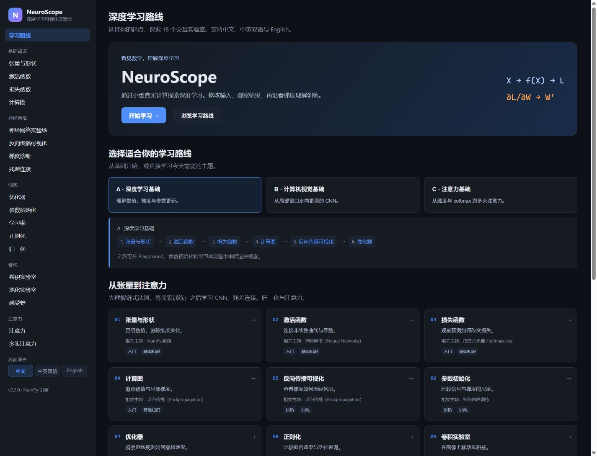

# NeuroScope · 深度学习可视化实验室

**把抽象公式变成可以观察、修改和验证的计算过程。**

NeuroScope 是面向深度学习入门与复习的交互式实验室。你可以改变张量形状、训练一个小型神经网络、追踪反向传播的梯度，或逐项查看注意力矩阵。**18 个实验室中的数值来自真实的 NumPy 计算**，界面支持 **中文 / 中英双语 / English**。

[](https://github.com/crockettetenebrusojd89-dev/NeuroScope/actions/workflows/tests.yml)

[快速开始](#quick-start) · [实验室一览](#实验室一览) · [演示与截图](#演示与截图) · [v0.3.0 发布](https://github.com/crockettetenebrusojd89-dev/NeuroScope/releases/tag/v0.3.0)



## 适合怎样学习？

- **刚开始学深度学习**：沿着学习路径，从张量、激活函数和损失函数逐步理解网络训练。
- **正在看课程或教材**：用可编辑输入验证公式，查看前向输出、反向梯度和中间矩阵。
- **想建立直观理解**：比较优化器轨迹，移动卷积窗口，观察残差连接与注意力权重。
- **想读懂实现**：直接阅读 NumPy 数学引擎；前端无需构建，不需要 GPU、模型下载或数据库。

普通说明使用中文，`reshape`、ReLU、Adam、BatchNorm、Q/K/V 等术语与代码标识符保留原名，便于对应课程和代码。语言选择会在刷新后保留；中英双语模式为页面主标题增加英文，正文保持中文。

## 从哪里开始？

首页提供三条可切换的推荐路线。选好路线后，点击「开始学习」，按概念顺序进入实验室。

| 路线 | 推荐顺序 |
|---|---|
| **A · 深度学习基础** | 张量 → 激活函数 → 损失函数 → 计算图 → 反向传播 → 优化器 |
| **B · 计算机视觉基础** | 张量 → 反向传播 → 卷积 → 池化 → 感受野 → 残差连接 → 归一化 |
| **C · 注意力基础** | 张量 → 激活函数 / softmax → 损失函数 → 归一化 → 自注意力 → 多头注意力 |

完整路径还包括参数初始化与正则化；神经网络实验场、梯度诊断、学习率实验室可作为配套练习。

进一步阅读：[学习路径说明](docs/LEARNING_PATH.md) · [CS231n 知识点对应](docs/CS231N_MAPPING.md)。NeuroScope 是独立项目，与 Stanford 官方课程没有隶属关系；部分详细技术文档仍使用英文。

<a id="quick-start"></a>

## 快速开始

需要 **Python 3.11–3.13** 和现代浏览器。日常使用无需 Node.js；运行前端验证脚本时需要 Node.js，CI 使用版本 24。

### 1. 获取项目

```sh
git clone https://github.com/crockettetenebrusojd89-dev/NeuroScope.git
cd NeuroScope
```

也可以从 [v0.3.0 发布页面](https://github.com/crockettetenebrusojd89-dev/NeuroScope/releases/tag/v0.3.0) 下载源码压缩包并解压。

### 2. 启动应用

**Windows 快捷方式**：安装 Python 后，在项目目录双击 `start.bat`。脚本会创建或使用本地虚拟环境、安装依赖并打开浏览器。

**手动启动（Windows / macOS / Linux）**：

```sh
python -m venv venv
```

根据系统激活环境：

```powershell
# Windows PowerShell
.\venv\Scripts\Activate.ps1
```

```sh
# macOS / Linux
source venv/bin/activate
```

然后安装依赖并启动：

```sh
python -m pip install -r requirements.txt
python -m uvicorn app.main:app --host 127.0.0.1 --port 8000 --workers 1
```

### 3. 打开并开始学习

浏览器访问 **http://127.0.0.1:8000/**。界面默认中文，侧边栏可以切换语言；窄屏点击导航按钮展开实验室列表。按 `Ctrl+C` 停止服务。

<details>
<summary>启动时遇到问题？</summary>

- **PowerShell 无法激活环境**：无需修改系统策略，直接把后续命令中的 `python` 换成 `venv\Scripts\python.exe` 即可。
- **找不到 Python 命令**：Windows 可尝试 `py`，macOS / Linux 可尝试 `python3`；确认版本为 3.11–3.13。
- **8000 端口被占用**：停止旧的 NeuroScope 实例，或将启动命令的 `--port 8000` 改为 `--port 8001`，再访问对应地址。
- **训练会话重启后消失**：当前会话保存在服务进程内存中，属于已知限制；请使用单个 worker。

</details>

## 实验室一览

| 方向 | 实验室 | 可以观察和操作的内容 |
|---|---|---|
| 基础知识 | 张量与形状、激活函数、损失函数、计算图 | 修改输入、移动滑块、查看形状与链式法则 |
| 神经网络 | 神经网络实验场、反向传播、梯度诊断 | 构建与训练小型 MLP，查看决策边界和逐层梯度 |
| 训练方法 | 参数初始化、优化器、学习率、正则化 | 比较信号尺度、参数更新轨迹和泛化表现 |
| 卷积网络 | 卷积、池化、感受野 | 移动窗口，计算输出形状与精确的输入依赖区域 |
| 现代组件 | 残差连接、归一化、自注意力、多头注意力 | 对比真实前向 / 反向计算，查看归一化维度、注意力矩阵与输出投影 |

## 演示与截图

下面的演示来自真实浏览器操作，不使用模拟训练结果。实验参数和机器性能会影响运行速度与结果。

**神经网络训练：观察决策边界随训练变化**


| 优化器轨迹对比 | 注意力权重检查 |
|---|---|
|  |  |

优化器演示通过增加迭代次数比较实际运行轨迹；注意力演示切换选中的 query 和未训练投影的随机种子。[录制与复现说明](docs/DEMO_RECORDING.md) 记录了操作步骤。

### 中文与双语界面

| 神经网络实验场 | 计算图 |
|---|---|
|  |  |


<details>
<summary>查看英文界面截图，便于对照术语与课程</summary>

以下六张主截图来自运行中的应用，浏览器视口统一设置为 1440 × 1100。


| 神经网络实验场 | 反向传播 |
|---|---|
|  |  |

| 卷积 | 自注意力 |
|---|---|
|  |  |


[中文优化器截图](docs/screenshots/optimizers-zh.png)

</details>

**在线体验尚未部署。** 当前可通过本地启动使用。项目依赖 FastAPI 数值接口，单独使用 GitHub Pages 无法运行后端；托管配置见 [部署说明](docs/DEPLOYMENT.md)。

## 实现与验证

```text
NumPy 数学引擎 → FastAPI JSON API → 原生 JavaScript 可视化界面
neuroscope/       app/api/           app/static/
```

前向传播、反向传播、梯度和优化器更新均保留显式实现，便于阅读和数值验证。详细设计见 [架构说明](docs/ARCHITECTURE.md) 与 [数学说明](docs/MATH_NOTES.md)。

| 目录 | 用途 |
|---|---|
| `neuroscope/core/` | 张量、激活函数、MLP、计算图、归一化、残差连接、注意力 |
| `neuroscope/layers/`、`losses/`、`optimizers/` | 网络层、损失函数与优化器 |
| `neuroscope/cnn/` | 卷积、池化与感受野计算 |
| `app/static/js/pages/` | 首页及按需加载的实验室页面 |
| `app/static/js/i18n.js`、`locales/` | 统一国际化管理与翻译资源 |

激活虚拟环境后，在项目根目录运行：

```sh
python -m pytest -q
node tests/validate_frontend.mjs
node tests/validate_docs.mjs
python tests/validate_live.py
```

`v0.3.0` 发布验证已在 **Linux 的 Python 3.11 / 3.12 / 3.13 和 Windows 的 Python 3.13** 上通过：每个任务 **107 项 Python 测试通过**，并完成 JS 语法、357 个翻译 key 对齐、文档与图片、独立应用启动及真实 HTTP 接口检查。

[发布时的 CI 记录](https://github.com/crockettetenebrusojd89-dev/NeuroScope/actions/runs/36992679754) · [最新 CI](https://github.com/crockettetenebrusojd89-dev/NeuroScope/actions) · [本地发布验证](docs/RELEASE_VALIDATION_v0.3.0.md) · [接手验证记录](docs/TAKEOVER_VALIDATION.md)

## 已知限制

- **归一化**：BatchNorm 主要展示二维批次 `X[N,D]` 的当前批次总体统计量，γ/β 为标量；没有运行统计量或训练 / 推理模式切换。
- **残差连接**：采用共享随机种子权重和固定目标进行受控梯度实验，不能作为训练 ResNet 或准确率对比的证据。
- **注意力**：输入为用户提供的数值嵌入，投影未训练；文本只标记矩阵行，没有 tokenizer、位置编码或 causal mask。
- **训练规模**：未实现完整 Transformer，也不是生产级模型训练框架。
- **会话状态**：训练会话保存在内存中，服务重启即丢失；需使用单个 worker，没有账户隔离或持久化学习进度。
- **输入与语言切换**：部分原有接口的输入校验不如 P2 严格；切换语言会重新渲染页面，可能重置当前控件。

## 维护与贡献

`v0.3.x` 已进入功能冻结阶段，重点是修复问题、改善学习体验、可访问性、性能和文档。是否在 `v0.4` 增加知识模块尚未确定。

欢迎提交范围清晰的修复和改进：数学结果必须来自真实计算，反向传播改动需有数值梯度验证，所有界面文案进入现有翻译资源。

[贡献指南](CONTRIBUTING.md) · [开发路线](docs/ROADMAP.md) · [更新日志](CHANGELOG.md) · [v0.3.0 发布说明](docs/RELEASE_NOTES_v0.3.0.md) · [GitHub 发布流程](docs/GITHUB_PUBLISHING.md)

## 开源许可

采用 [MIT License](LICENSE)，允许使用、修改与分发，具体条件以许可证为准。

© 2026 NeuroScope contributors
