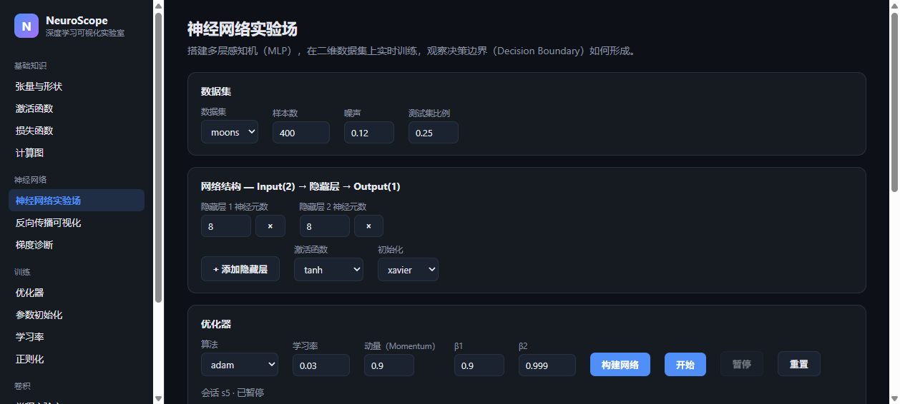
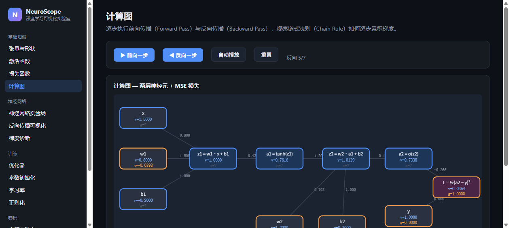
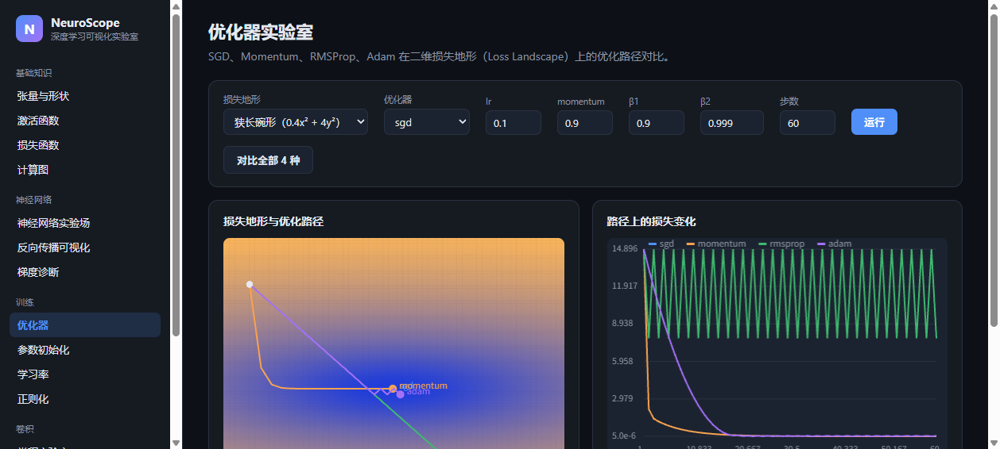
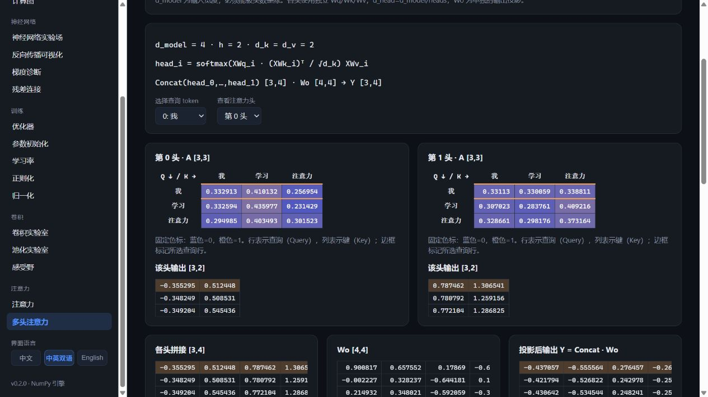

# NeuroScope

**An interactive deep learning visualization laboratory.**

NeuroScope helps learners build real intuition for the core concepts of deep
learning — tensors, activations, losses, backpropagation, optimization and
convolution — by making every one of them *something you can touch*.

The entire numerical engine is written in **plain NumPy** (no deep-learning
frameworks), so every forward pass and every gradient can be read, printed
and checked by hand.


**界面语言 / UI languages: 中文（默认）· 中英双语 · English**

---

## Features

### Fundamentals
- **Tensor & Shape Lab** — reshape, transpose, matmul, broadcasting and axis
  reductions with live before/after shapes.
- **Activations Lab** — ReLU, Sigmoid, Tanh, Leaky ReLU, GELU, Softmax: curves,
  derivatives, and live `f(x)` / `f′(x)` readouts.
- **Loss Lab** — MSE, Binary Cross Entropy, Cross Entropy: drag the prediction,
  watch the loss and its gradient respond.
- **Computational Graph** — step through a forward pass, then a backward pass;
  local gradients on every edge make the chain rule explicit.

### Networks
- **Neural Network Playground** — XOR / Moons / Circles / Spiral / Blobs with
  adjustable size, noise and train/test split. Build `Input → Hidden → Output`
  with configurable layer count, neurons and activation.
- **Training Playground** — live training/validation loss, accuracy and
  decision boundary with **Start / Pause / Resume / Reset**.
- **Backpropagation Visualizer** — loss → output gradient → per-layer `dW`/`db`,
  summary first (norms, histograms) with drill-down into small matrices.
- **Gradient Diagnostics** — per-layer gradient norms with vanishing /
  exploding detection.

### Training dynamics
- **Optimization Lab** — SGD, Momentum, RMSProp and Adam racing across 2D loss
  landscapes (elongated bowl, Rosenbrock, saddle) with tunable hyperparameters.
- **Initialization Lab** — Zeros vs Random vs Xavier vs He through a 10-layer
  network: activation variance and gradient norms per layer.
- **Learning Rate Lab** — too small / appropriate / too large learning rates
  side by side.
- **Regularization Lab** — None vs L1 vs L2 vs Dropout: train/val accuracy and
  decision-boundary complexity.

### Convolution
- **Convolution Lab** — sliding-window animation: kernel, element-wise
  products, summation, feature map; kernel size/stride/padding with live
  output-shape formula.
- **Pooling Lab** — max and average pooling, window by window.

## Screenshots

Captured from real runs (Chinese UI shown; English and bilingual modes available).

| Network Playground (神经网络实验场) | Computational Graph (计算图) | Optimization Lab (优化器实验室) |
|---|---|---|
|  |  |  |

P2 example (captured from a real bilingual run):



## Internationalization

The whole UI ships in three language modes, switchable instantly from the
sidebar and persisted across sessions:

- **中文** (default) — natural Chinese UI with「中文（English）」terminology
- **中英双语** — main titles in both languages, uncluttered body text
- **English**

Implementation: a central i18n module (`app/static/js/i18n.js`) with locale
resources (`locales/zh-CN.js`, `locales/en-US.js`, 298 keys each). Even the
Tensor Lab's explanations and error messages are localized end-to-end: the
backend returns structured i18n keys + params, rendered client-side.

## Installation

Requires **Python 3.11+** and a browser. Nothing else.

```bash
git clone https://github.com/<your-org>/neuroscope.git
cd neuroscope
python -m venv venv
venv\Scripts\activate        # Windows
# source venv/bin/activate   # macOS / Linux
pip install -r requirements.txt
```

## Quick Start

### Windows (one click)

Double-click **`start.bat`**. It creates/uses the project-local `venv`,
installs dependencies, starts the server and opens your browser.

### Any platform

```bash
uvicorn app.main:app --host 127.0.0.1 --port 8000
# then open http://127.0.0.1:8000
```

### Run the tests

```bash
pytest -q
node tests/validate_frontend.mjs   # JS syntax, locale parity, routing regression
python tests/live_smoke.py       # real HTTP checks; start the app first
```

106 tests, including **numerical gradient checking** for every backward pass
and hand-computed convolution/pooling references.

## Architecture

```
neuroscope/                 # NumPy engine — no UI code here
  core/
    activations.py          # ReLU/Sigmoid/Tanh/LeakyReLU/GELU/Softmax + grads
    initializers.py         # zeros / random / xavier / he
    network.py              # MLP: forward, backward, dropout, L1/L2
    graph.py                # tiny computational-graph engine
    tensor_ops.py           # reshape/transpose/matmul/broadcast/axis ops
  layers/linear.py          # Linear layer: forward / backward
  losses/losses.py          # MSE, BCE, Cross Entropy (fused, stable)
  optimizers/optimizers.py  # SGD, Momentum, RMSProp, Adam
  datasets/datasets.py      # XOR, moons, circles, spiral, blobs
  diagnostics/gradients.py  # gradient reports, health, init-lab runs
  cnn/conv.py               # conv2d / pool2d with explicit loops
app/
  main.py                   # FastAPI entry (serves API + static UI)
  api/routes.py             # thin JSON layer over the engine
  static/                   # dependency-free vanilla-JS SPA
    js/pages/               # one module per lab
tests/                      # pytest, incl. numerical gradient checking
docs/                       # ARCHITECTURE / MATH_NOTES / ROADMAP / report
examples/                   # runnable scripts using the engine directly
```

Design rules:

1. **UI and core are strictly separated** — the engine never imports the app.
2. **Math must be readable** — formulas live in docstrings, loops are explicit.
3. **No fabricated results** — everything the UI shows comes from a real run.

## Learning modules

| Module | Concept | Interaction |
|---|---|---|
| Tensor & Shape Lab | shapes, broadcasting, axes | edit tensors, apply ops |
| Activations Lab | nonlinearity, derivatives | slider over x, live f(x)/f′(x) |
| Loss Lab | loss surfaces | drag prediction |
| Computational Graph | chain rule | step forward/backward |
| Playground | representation learning | build & train an MLP live |
| Backprop Visualizer | gradient flow | per-layer drill-down |
| Optimization Lab | optimizer dynamics | race optimizers on landscapes |
| Initialization Lab | variance flow | compare 4 initializers |
| Learning Rate Lab | step size | compare loss curves |
| Regularization Lab | overfitting | compare boundaries |
| Convolution Lab | feature extraction | animate the sliding window |
| Pooling Lab | downsampling | animate max/avg windows |
| Gradient Diagnostics | gradient health | inspect per-layer norms |

## Roadmap

All five P2 labs are implemented, in addition to the 13 existing pages:

| Lab | Real calculation and interaction |
|---|---|
| Normalization | training-batch BatchNorm/LayerNorm on X[N,D]; editable ε/γ/β; group/axis highlighting, means, population variances, distributions |
| Receptive Field | per-layer kernels/strides/padding; map size, jump, RF; exact sparse input dependencies including intermediate padding |
| Residual Connection | shared seeded weights; plain vs residual tanh forward/backward; identity-path gradients and per-depth norms |
| Self-Attention | editable numeric embeddings; Q/K/V projections, scores, √d_k scaling, softmax, fixed-scale true heatmaps, token contributions |
| Multi-Head Attention | independent per-head projections/maps, concat, Wo projection; d_model/head divisibility and shape validation |

These are teaching experiments: BatchNorm uses current-batch statistics and
scalar γ/β; residual comparison uses a fixed linear probe without training;
attention uses supplied embeddings and seeded untrained projections, without
positional encodings or masking. Token text labels numerical input rows.
See [docs/MATH_NOTES.md](docs/MATH_NOTES.md) for formulas and
[docs/TAKEOVER_VALIDATION.md](docs/TAKEOVER_VALIDATION.md) for independent
validation and limitations. [docs/ROADMAP.md](docs/ROADMAP.md) tracks future work.

## Contributing

See [CONTRIBUTING.md](CONTRIBUTING.md). The short version: NumPy-only engine,
numerical gradient checks for every backward pass, no fabricated results.

## License

[MIT](LICENSE) © 2026 NeuroScope contributors
