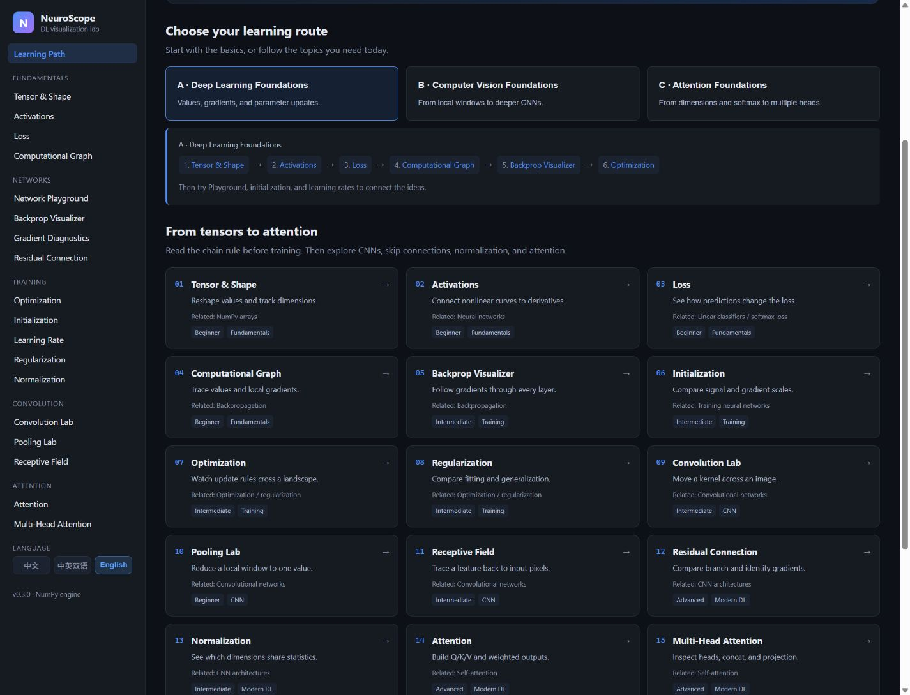
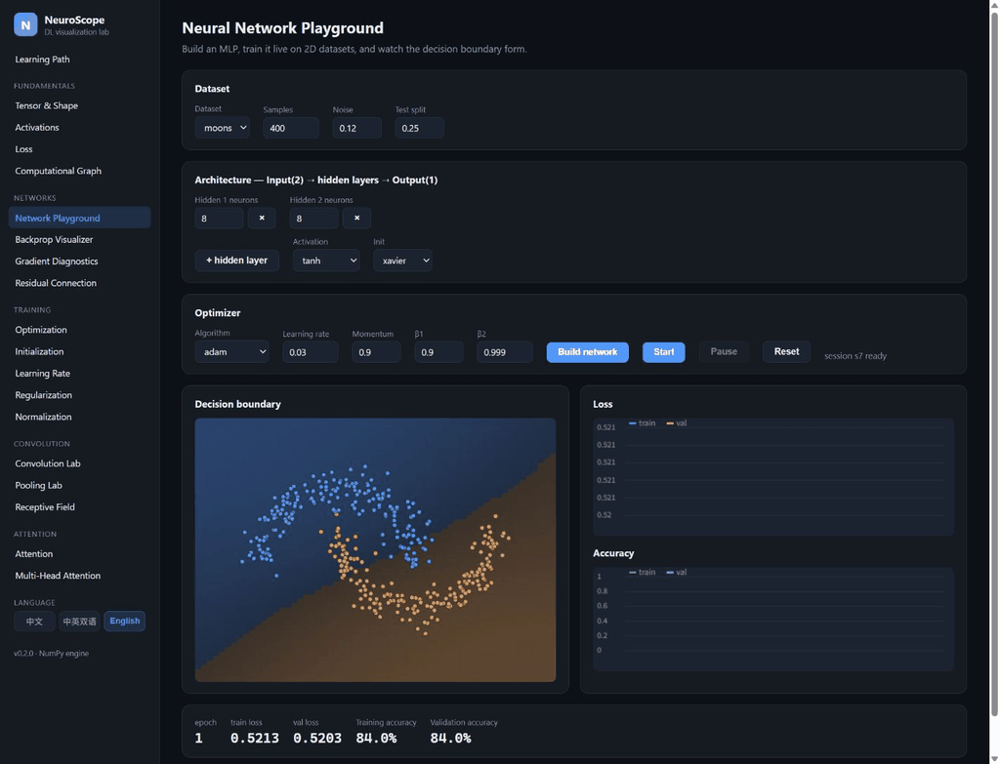
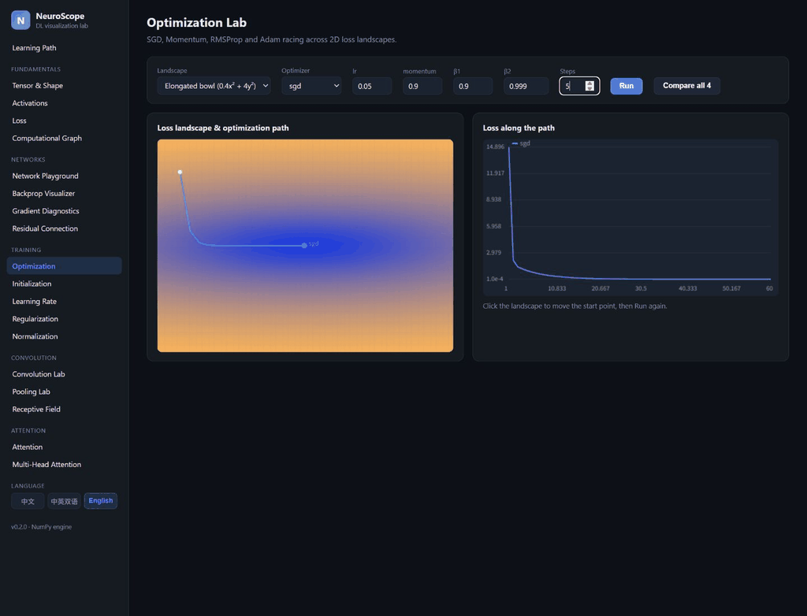
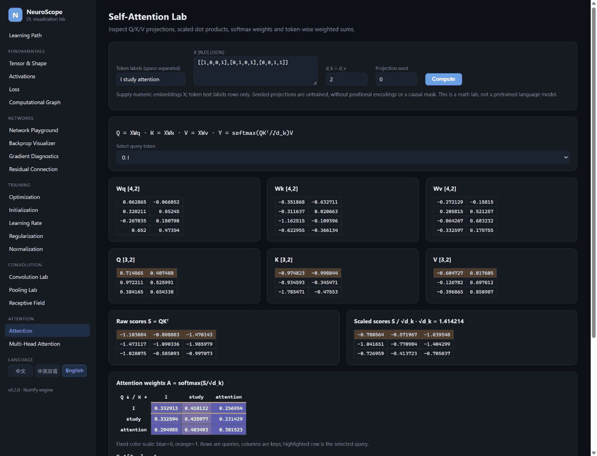
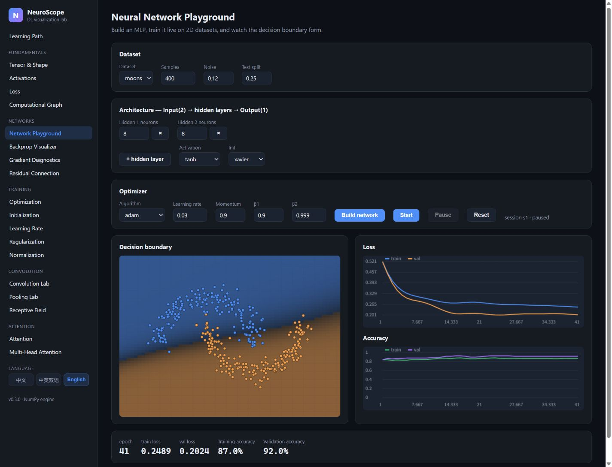
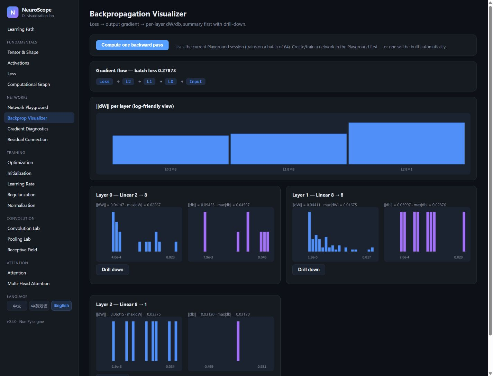
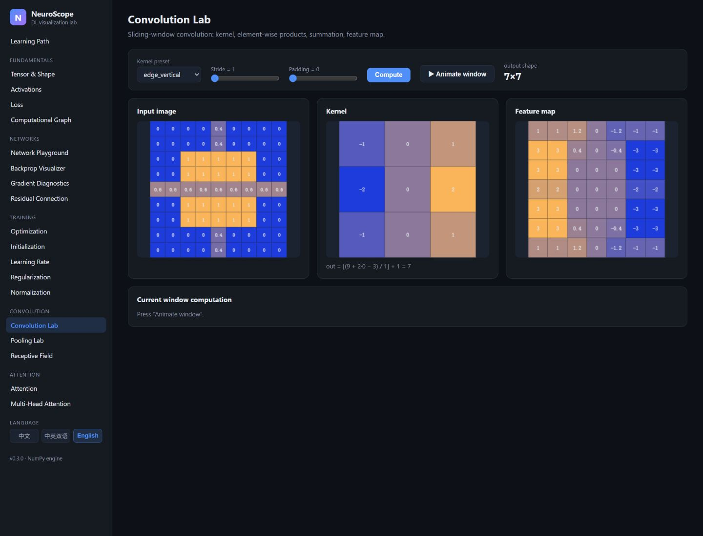
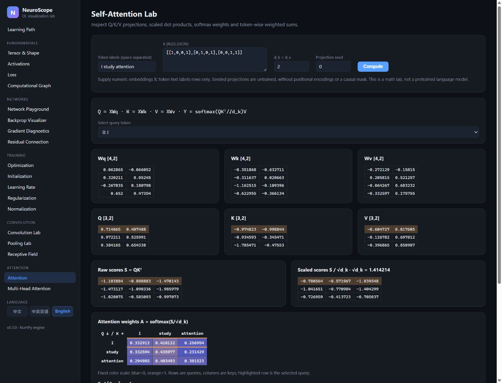
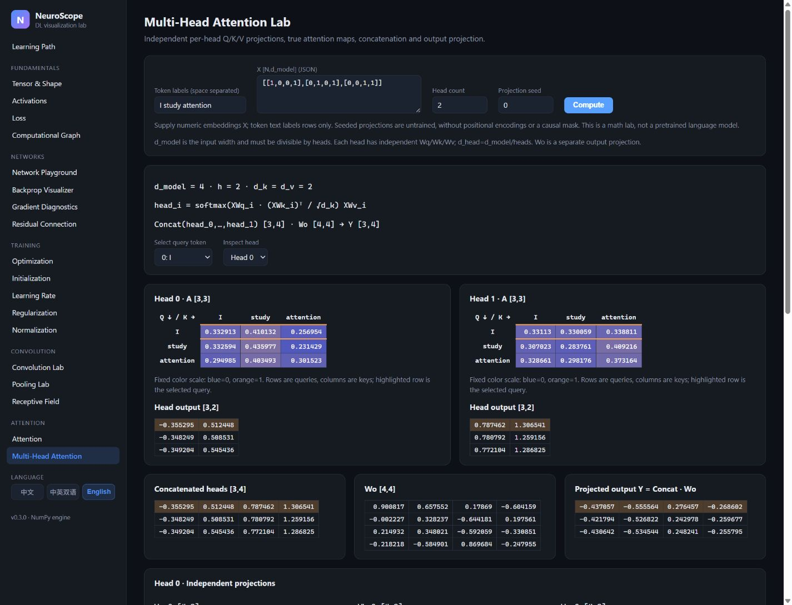

# NeuroScope

**Interactive deep learning visualization laboratory.**

Learn deep learning by seeing what the math is doing.

Change a tensor, train a small network, trace a gradient, or inspect attention
weights. NeuroScope connects the formulas to real NumPy calculations in
**18 interactive labs**, with **中文 / 中英双语 / English** interfaces.



## Features

- **Find a starting point.** A Learning Path home with three recommended routes,
  short explanations, difficulty labels, and links to every existing lab.
- **Follow the math.** Editable inputs, forward/backward values, layer gradients,
  optimizer paths, convolution windows, and attention matrices.
- **Learn by experimenting.** Train a small MLP on 2D data, compare initialization
  and regularization, or change the dimensions a normalization method uses.
- **Read the implementation.** A NumPy educational engine with numerical tests;
  no model downloads, GPU, frontend build step, account, or database required.
- **Switch languages instantly.** Chinese by default; bilingual mode adds English
  page titles; the sidebar choice persists after refresh.

## Learning Path

| Route | Existing labs, in recommended order |
|---|---|
| **A · Deep Learning Foundations** | Tensor → Activations → Loss → Graph → Backprop → Optimization |
| **B · Computer Vision Foundations** | Tensor → Backprop → Convolution → Pooling → Receptive Field → Residual → Normalization |
| **C · Attention Foundations** | Tensor → Activations / softmax → Loss → Normalization → Self-Attention → Multi-Head Attention |

The complete concept path adds initialization and regularization before CNNs.
Playground, Gradient Diagnostics, and Learning Rate are companion experiments.
See [Learning Path](docs/LEARNING_PATH.md) for the order and
[CS231n topic mapping](docs/CS231N_MAPPING.md) for official reading links.
NeuroScope is an independent project, not an official Stanford course tool.

## Quick Start

Requires **Python 3.11–3.13** and a modern browser. Node.js is only needed for
frontend validation. This repository has no remote configured yet: obtain the
source ZIP or clone the repository URL chosen by its owner, then open its folder.

```sh
python -m venv venv
```

Activate the environment:

```powershell
# Windows PowerShell
.\venv\Scripts\Activate.ps1
```

```sh
# macOS / Linux
source venv/bin/activate
```

If PowerShell activation is restricted, use `venv\Scripts\python.exe` instead
of `python` in the commands below; activation is optional.

Then install and run:

```sh
python -m pip install -r requirements.txt
python -m uvicorn app.main:app --host 127.0.0.1 --port 8000 --workers 1
```

Open **http://127.0.0.1:8000/**, select a route, and click **Start Learning**.
On Windows, `start.bat` also creates/uses the local environment, installs the
requirements, and opens the app. If port 8000 is already in use, stop your old
NeuroScope server or use another port. Stop the server with Ctrl+C.

## Demo

These recordings show actual page calculations, not mock data or model benchmarks.
Training speed and results depend on the experiment parameters and machine.



| Optimizer comparison | Attention inspection |
|---|---|
|  |  |

The optimizer recording compares real runs at increasing step counts. The
attention recording changes the selected query and the untrained projection
seed. [Recording notes and reproduction steps](docs/DEMO_RECORDING.md) describe
both; neither recording implies capabilities beyond the visible controls.

**Live Demo:** not deployed yet. [Deployment guide](docs/DEPLOYMENT.md) describes
native Python hosting; a static-only host cannot run the numerical API.

## Screenshots

Captured from a running app at a common 1440 × 1100 browser viewport, English UI.
The Learning Path hero above is the sixth primary screenshot.

| Network Playground | Backpropagation |
|---|---|
|  |  |

| Convolution | Self-Attention |
|---|---|
|  |  |



[Chinese home](docs/screenshots/home-zh.jpg) and the earlier
[Chinese Playground](docs/screenshots/playground-zh.png),
[Graph](docs/screenshots/graph-zh.png), [Optimization](docs/screenshots/optimizers-zh.png),
and [bilingual Multi-Head Attention](docs/screenshots/multihead-bi.jpg) are also retained.

## Architecture

```text
NumPy educational engine → FastAPI JSON API → Vanilla JavaScript visualization
neuroscope/                app/api/             app/static/
```

The engine keeps forward passes, backward passes, gradients, and optimizer
updates readable and testable. This is a teaching choice: frameworks such as
PyTorch serve different needs, including automatic differentiation and larger
training workloads. NeuroScope exposes the small calculations learners are
trying to understand.

- `neuroscope/core/`: tensors, activations, MLP, graph, normalization, residuals, attention.
- `neuroscope/layers/`, `losses/`, `optimizers/`: explicit mathematical components.
- `neuroscope/cnn/`: convolution, pooling, receptive-field geometry.
- `app/main.py`: one FastAPI service for JSON and static assets.
- `app/static/js/pages/`: lazy-loaded labs and home; no frontend framework.
- `app/static/js/i18n.js` and `locales/`: shared translation resources.

[Architecture](docs/ARCHITECTURE.md) · [Math notes](docs/MATH_NOTES.md)

## Supported Labs

| Area | Labs | Main interaction |
|---|---|---|
| Fundamentals | Tensor & Shape, Activations, Loss, Computational Graph | Edit values, move sliders, trace the chain rule |
| Networks | Playground, Backpropagation, Gradient Diagnostics | Build/train an MLP; inspect layer gradients |
| Training | Initialization, Optimization, Learning Rate, Regularization | Compare signal scales, updates, and generalization |
| CNN | Convolution, Pooling, Receptive Field | Move windows; compute shapes and exact dependencies |
| Modern DL | Residual Connection, Normalization, Self-Attention, Multi-Head Attention | Compare real forward/backward branches; inspect axes and attention matrices |

## Testing

With the virtual environment active:

```sh
python -m pytest -q
node tests/validate_frontend.mjs
node tests/validate_docs.mjs
python tests/validate_live.py
# Or use an existing server on port 8000:
# python tests/live_smoke.py
```

The release-preparation baseline had **106 passing Python tests**. The current
suite includes an additional padded-window regression, frontend routing,
translation parity, rendered-page regressions, and real HTTP smoke checks.
See [release validation](docs/RELEASE_VALIDATION_v0.3.0.md) for exact measured
results and [previous takeover validation](docs/TAKEOVER_VALIDATION.md) for history.
GitHub Actions runs the same four checks on Linux (Python 3.11/3.12/3.13)
and Windows (3.13). A remote Actions run is still pending publication.

## Scope and Limitations

- BatchNorm teaches a **2D current batch** `X[N,D]`, with population variance and
  scalar γ/β. It has no running statistics or train/eval switch.
- Residual Lab is a **controlled gradient experiment** with shared seeded weights
  and a fixed objective, not an accuracy benchmark or a trained ResNet.
- Attention uses user-supplied numeric embeddings and **untrained projections**.
  Token text labels rows; there is no tokenizer, positional encoding, or causal mask.
- There is **no complete Transformer or production model training framework**.
- Playground sessions live in server memory and disappear on restart. Use a
  single worker. This demo has no account system or production multi-user isolation.
- Language changes re-render a lab and may reset its controls. Most original
  labs have more limited input validation than the P2 endpoints.

## Roadmap

**Feature Freeze:** v0.3.x focuses on bugs, accessibility, performance,
documentation, and learning UX. Whether v0.4 adds knowledge modules is undecided.
[Roadmap](docs/ROADMAP.md) · [v0.3.0 release notes](docs/RELEASE_NOTES_v0.3.0.md)

## Contributing

Small, focused fixes and learning-experience improvements are welcome.
Math results must be real; backward changes need numerical gradient checks;
all UI text belongs in the existing locale dictionaries.
Read [CONTRIBUTING.md](CONTRIBUTING.md) before making a change.

## Publishing and License

The project is prepared locally; no remote repository, tag, or GitHub Release
has been created. The owner should follow [GitHub publishing](docs/GITHUB_PUBLISHING.md)
when the destination is known.

[MIT](LICENSE) © 2026 NeuroScope contributors
